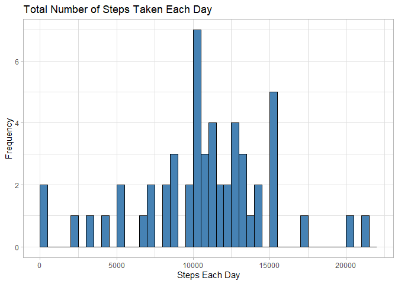
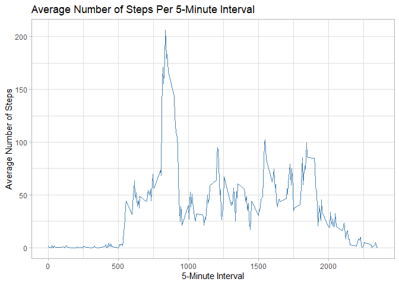
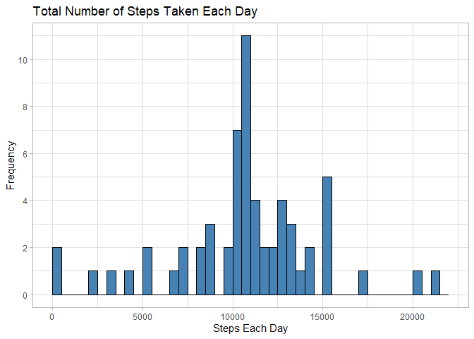
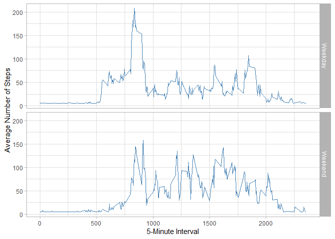

___
## Import the data and load libraries

```r
knitr::opts_chunk$set(echo = TRUE, results = TRUE)
suppressWarnings(suppressMessages(library(readr)))
suppressWarnings(suppressMessages(library(xtable)))
suppressWarnings(suppressMessages(library(Hmisc)))
suppressWarnings(suppressMessages(library(dplyr)))
suppressWarnings(suppressMessages(library(ggplot2)))
options(scipen=999)
activity <- read_csv("activity.csv", col_types = cols(date = col_date(format = "%Y-%m-%d"),     interval = col_integer(), steps = col_integer()))
```
___
## What are the mean and median total number of steps taken per day?


### 1. Calculate the total number of steps taken per day


```r
activeByDate <- aggregate(activity["steps"], by=activity["date"],sum)
```

### 2. Make a histogram of the total number of steps taken each day.


```r
ggplot(data=activeByDate, aes(activeByDate$steps))+ 
      geom_histogram(breaks = seq(0,22000,500), col="black", fill="steel blue", na.rm = TRUE) + 
            labs(title="Total Number of Steps Taken Each Day") +
            labs(x="Steps Each Day", y="Frequency") + 
            theme_light()
```

<!-- -->

### 3. Calculate and report the mean and median of the total number of steps taken per day


```r
activeMean <- round(mean(activeByDate$steps, na.rm = TRUE), digits=2)
activeMedian <- median(activeByDate$steps, na.rm = TRUE)
```

#### *The mean number of total steps taken each day is <span style="color:green">**10766.19**</span>.*

#### *The median number of total steps taken each day is <span style="color:green">**10765**</span>.*

___

## What is the average daily activity pattern?

<style>
  th,td{
     padding:2px 5px 2px 5px;
  }
</style>


```r
# Aggregate and average the data by interval
activeByInterval <- aggregate(activity["steps"], by=activity["interval"], 
                              FUN = mean, na.rm = TRUE)
```

### 1. Make a time series plot of the 5-minute interval (x-axis) and the average number of steps taken, averaged across all days (y-axis) 


```r
ggplot(data=activeByInterval, aes(x=interval, y=steps)) +
    geom_line(col = "steel blue") +
      labs(title="Average Number of Steps Per 5-Minute Interval") +
      labs(x="5-Minute Interval") +
      labs(y="Average Number of Steps") +
      theme_light()
```

<!-- -->

### 2. Which 5-minute interval, on average across all the days in the dataset, contains the maximum number of steps?


```r
maxInterval <- activeByInterval[which.max(activeByInterval$steps),]
print(xtable(maxInterval), type = "html", include.rownames=FALSE)
```

<!-- html table generated in R 3.5.1 by xtable 1.8-4 package -->
<!-- Thu Aug 15 12:55:03 2019 -->
<table border=1>
<tr> <th> interval </th> <th> steps </th>  </tr>
  <tr> <td align="right"> 835 </td> <td align="right"> 206.17 </td> </tr>
   </table>
#### *The average maximum number of steps is <span style="color:green">**206.17**</span> which occurs during the <span style="color:green">**835**</span> interval.*

___
## Imputing missing values


### 1. Calculate and report the total number of missing values in the dataset (i.e. the total number of rows with NAs)

```r
numNA <- sum(is.na(activity$steps))
```

#### *There are <span style="color:green">**2304**</span> NAs in the data.*


### 2. Devise a strategy for filling in all of the missing values in the dataset. The strategy does not need to be sophisticated. For example, you could use the mean/median for that day, or the mean for that 5-minute interval, etc.

### 3. Create a new dataset that is equal to the original dataset but with the missing data filled in.

```r
activityImputed <- activity
activityImputed$steps <- impute(activity$steps, fun = mean)
```

### 4. Make a histogram of the total number of steps taken each day and calculate and report the mean and median total number of steps taken per day. 

```r
activeImputedByDate <- aggregate(activityImputed["steps"], by=activityImputed["date"],sum)
ggplot(data=activeImputedByDate, aes(activeImputedByDate$steps))+ 
      geom_histogram(breaks = seq(0,22000,500), col="black", fill="steel blue", na.rm = TRUE) + 
      scale_y_continuous(breaks = seq(0,12,2)) +
            labs(title="Total Number of Steps Taken Each Day") +
            labs(x="Steps Each Day", y="Frequency") + 
            theme_light()
```

<!-- -->

```r
# Calculate the imputed mean and median number of total steps each day
imputedMean <- round(mean(activeImputedByDate$steps, na.rm = TRUE), digits=2)
imputedMedian <- round(median(activeImputedByDate$steps, na.rm = TRUE), digits=2)
```

#### *The imputed mean number of total steps taken each day is <span style="color:green">**10766.19**</span>.*

#### *The median number of total steps taken each day is <span style="color:green">**10766.19**</span>.*


### 5. Do these values differ from the estimates from the first part of the assignment? What is the impact of imputing missing data on the estimates of the total daily number of steps?


#### <span style="color:green">*The imputed mean is the same value as the original mean. The imputed median is now equal to the imputed mean and slightly more than the original median.*</span>
___

## Are there differences in activity patterns between weekdays and weekends?
#### For this part the <span style="color:red">**weekdays()**</span> function may be of some help here. Use the dataset with the filled-in missing values for this part.


### 1. Create a new factor variable in the dataset with two levels - "Weekday" and "Weekend" indicating whether a given date is a weekday or weekend day.


```r
activityImputed$dayType <- ifelse(weekdays(activityImputed$date) %in% 
                                        c("Saturday","Sunday"), "Weekend", "Weekday")
```

### 2. Make a panel plot containing a time series plot of the 5-minute interval (x-axis) and the average number of steps taken, averaged across all weekday days or weekend days (y-axis).


```r
averageActivityImputed <- aggregate(steps ~ interval + dayType, data=activityImputed, FUN = mean)

ggplot(averageActivityImputed, aes(interval, steps)) + 
      geom_line(color = "steel blue") + 
      facet_grid(dayType ~ .) +
      xlab("5-Minute Interval") + 
      ylab("Average Number of Steps") + 
      theme_light()
```

<!-- -->

___


